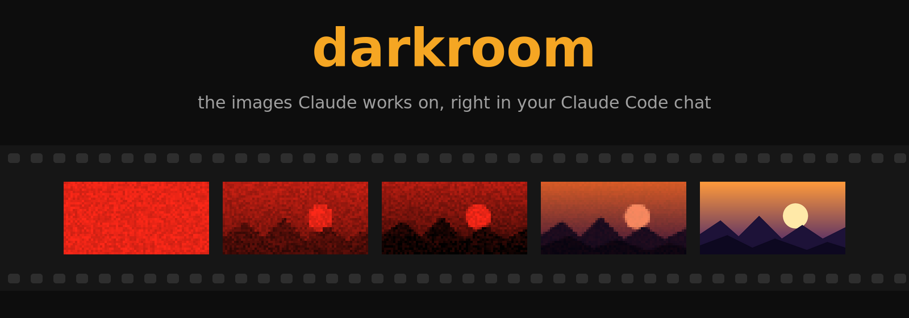
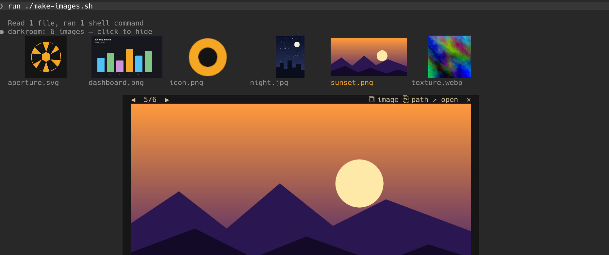
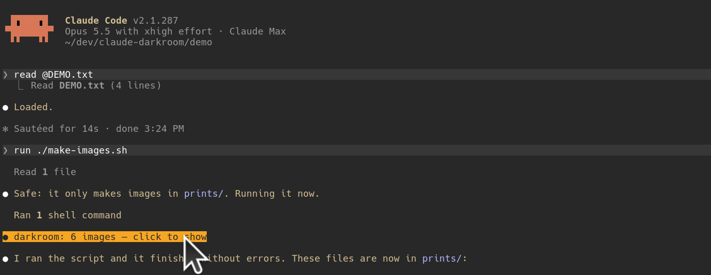
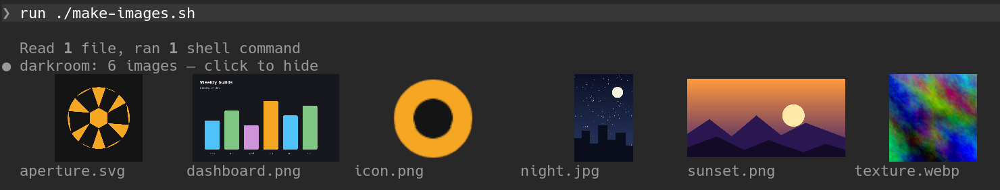
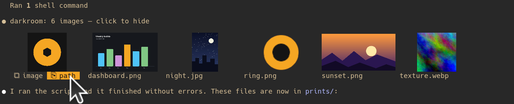
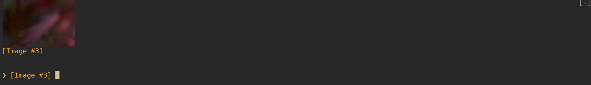

<p align="center">
  
</p>

<p align="center">
  <a href="#install"></a>
  <a href="#which-terminal"></a>
  
  
</p>

**Claude Code runs in a terminal.** When Claude opens a screenshot, draws a chart or saves an image, all you see is a file name.

**darkroom shows you the picture**, right in the chat, where it happened:



## Install

In Claude Code, type:

```
/plugin marketplace add govlog/claude-darkroom
/plugin install darkroom@claude-darkroom
```

Then start a new session. PNG images need nothing more. For JPEG, GIF, WebP, AVIF, SVG, BMP and TIFF, also install ImageMagick:

```
brew install imagemagick        # macOS
sudo apt install imagemagick    # Debian, Ubuntu
```

### Which terminal

You see real pictures in **Ghostty** or **kitty**, on Linux or macOS: they speak the kitty graphics protocol, which lets a program draw images in the terminal. In any other terminal, in tmux or over ssh, you get a coarser preview made of colored blocks. Everything else works the same.

## How to use it

### 1. A line shows under each image Claude touches. Click it.



The thumbnails unroll under the line. The first time, they develop like a photo under a red light.



### 2. Click a thumbnail to see it big

The picture opens under the thumbnails, as at the top of this page. Click its right half for the next one, its left half for the one before, or beside it to close. The arrow keys work too.

### 3. Hover a thumbnail to copy it



Rest the pointer on a thumbnail: `⧉ image` copies the picture itself, `⎘ path` copies its path.

### 4. Ask Claude to show you images

```
> show me the icons of this project
> display the 3 screenshots in docs/
```

Claude finds the files and shows them, old images as well as new ones.

### 5. See your pasted images before you send



Paste an image in the prompt box: its thumbnail shows just above it.

## Mouse and keys

| | |
|---|---|
| Click the line | show or hide the thumbnails |
| Click a thumbnail | see it big |
| Click the right or left half of the picture | the next or the previous one |
| Click beside the picture | close it |
| <kbd>←</kbd> <kbd>→</kbd> (or <kbd>h</kbd> <kbd>l</kbd>) | the next or the previous one, after a click |
| <kbd>i</kbd> · <kbd>c</kbd> · <kbd>o</kbd> · <kbd>x</kbd> | copy the image · copy its path · open it in your image viewer · close |
| `/darkroom` | every image of the session |

Clicks and hover need Claude Code's fullscreen mode, which passes the mouse on to darkroom.

## Settings

```
/darkroom settings                      # what is set now
/darkroom set auto-show on              # show the thumbnails without a click
/darkroom set develop off               # no red-light effect
/darkroom set opener feh --scale-down   # what opens an image (default: open on macOS, xdg-open on Linux)
```

A setting applies at once and is kept for the next sessions.

<details>
<summary><b>Requirements</b></summary>

| | |
|---|---|
| Claude Code | 2.1.287 or newer, in fullscreen mode for clicks and hover |
| ImageMagick | only for JPEG, GIF, WebP, AVIF, SVG, BMP and TIFF: 7 (`magick`), or 6 (`convert`, `identify`) |
| Terminal | Ghostty or kitty for real pictures, on Linux (Wayland or X11) or macOS |
| Clipboard | to copy an image: `wl-copy` on Wayland, `xclip` on X11, `osascript` on macOS |

</details>

<details>
<summary><b>How it works</b></summary>

- A `tool.call` hook looks for image paths in each call's arguments and, for commands and MCP tools, in its output. A path counts only if the call read it, wrote it, or changed it: an `ls` that lists images does not put them on the roll. To see what a listing found, ask Claude to show it.
- `show` is a tool darkroom declares for Claude, `mcp__darkroom__show`. Claude passes it image paths. darkroom checks each one, puts it on a strip under the call, and answers with the names it shows and the ones it skipped, with why.
- A PNG is read and decoded by darkroom itself, inside the mod's sandbox: its size from its header, and the small pixel grid the develop and the half-block fallback paint from. The terminal draws the picture straight from the file.
- Whether your terminal draws pictures is Claude Code's to know, and darkroom asks it once the first picture is up (`$.ui.blit` on it answers, or says the picture is not drawn). Where the terminal draws none, in tmux, or at the far end of ssh, the rows paint half-block cells from the pixel grid instead. darkroom reads no environment variable, for this or for anything else.
- Any other format goes to ImageMagick, under the policy darkroom ships: it reads the size, writes a PNG copy into Claude Code's own temporary folder and prints the pixel grid.
- The rows are `ui.render` hooks on tool results, tool groups, your messages and the output of `/darkroom`. Each picture is an `Image` element: Claude Code passes it to the terminal with the kitty graphics protocol. A clear `Client` layer over the pictures and the viewer's toolbar takes the clicks, the hover and the keys, and never draws, so the pictures stay. A press over it never reaches the transcript: a quick click or one that slips never selects text.

</details>

## Privacy and security

In short: darkroom works on your machine only. It makes no network call and collects nothing, and Claude never gets the pixels of an image through it. The privacy policy is in [PRIVACY.md](PRIVACY.md); below, every program darkroom runs, and why.

**What darkroom sends, and where.** Nothing leaves your machine. What darkroom reads (image files, the text of tool calls, your draft prompt) goes to your screen and to the session's state, and nowhere else: not to a program, not to Claude, not to the network. What does leave darkroom is, at your click, an image or its path to your clipboard and an image path to your image viewer; and, for an image that is not a PNG, its path to ImageMagick on your machine, which converts it. No program darkroom runs gets a word of the conversation.

darkroom never puts text in a prompt, runs a tool or runs a command of its own accord.

**Programs it runs, and why.** Each by name with its arguments, the image path always one argument of its own:

- No program for a PNG: darkroom decodes it in its own sandbox, with no access to files, programs or the network beyond what Claude Code hands it.
- ImageMagick (`magick`, or `convert` and `identify`), for the other formats only: to read the size, to convert the image to PNG for the terminal, and to make the small pixel grid. darkroom names the decoder from the file's extension (`JPEG:`, `GIF:`…), so ImageMagick never guesses a format from a file's bytes, and runs it under [`magick/policy.xml`](magick/policy.xml): those formats and nothing else, no delegate program, no network, no indirect file lists, bounded memory, size and time.
- `magick -version`, or else `convert -version`, once per session: to see whether ImageMagick is installed, and which version.
- `id -u`, once per session, and on macOS `getconf DARWIN_USER_TEMP_DIR`: to find Claude Code's own temporary folder, `<tmp>/claude-<uid>`, where it keeps your pasted images and where ImageMagick leaves its PNG copies. `<tmp>` is `/tmp` on Linux and the folder `getconf` names on macOS: darkroom reads no environment variable. macOS is told from Linux by a file only macOS has, with no program.
- To copy an image: `osascript` on macOS, run directly. On Linux, `sh -c` with one fixed script, because `wl-copy` reads the picture on its standard input: the script hands it the file, or runs `xclip` where `wl-copy` is missing or fails (no Wayland display), the path passed as an argument, never part of the script. It reads no variable of the environment.
- Your opener, when you press open: `open` on macOS, `setsid -f xdg-open` on Linux so the viewer outlives the call, or the command you set.

**The exact commands.** Every program darkroom can run, as it runs it: `<image>` is the absolute path of the image, `<png>` the image itself or its PNG copy, `<id>` a hash of the path and its date, `W`×`H` the size of the pixel grid. The path is always one argument of its own, never part of a script:

```sh
# once per session
id -u
getconf DARWIN_USER_TEMP_DIR     # macOS only
magick -version                  # or, without ImageMagick 7: convert -version

# a JPEG, GIF, WebP, AVIF, SVG, BMP or TIFF image, with MAGICK_CONFIGURE_PATH=<plugin>/magick
# (JPEG: stands for the decoder the extension names; ImageMagick 6 runs convert and identify)
magick identify -format '%w %h %m' 'JPEG:<image>[0]'
magick 'JPEG:<image>[0]' -resize '2048x2048>' 'PNG:<tmp>/claude-<uid>/darkroom-<id>.png'
magick 'JPEG:<image>[0]' -background '#141414' -flatten -resize 'WxH!' -depth 8 -compress none ppm:-

# copy image, on macOS
osascript -e 'on run argv' -e 'set the clipboard to (read (POSIX file (item 1 of argv)) as «class PNGf»)' -e 'end run' '<png>'
# copy image, on Linux
sh -c '{ { command -v wl-copy && wl-copy --type image/png <"$1"; } || { command -v xclip && xclip -selection clipboard -t image/png -i "$1"; } || exit 3; } >/dev/null 2>&1' darkroom '<png>'

# open, on macOS; an opener you set runs in place of open
open '<image>'
# open, on Linux; an opener you set runs in place of xdg-open
setsid -f xdg-open '<image>'
```

**Hooks it uses, and what they do.**

- `tool.call` reads each call's arguments, and the output of commands and MCP tools, for the image paths the call worked on. It never changes another tool's call. It answers in a tool's place for one tool only, darkroom's own `show`: the hook on `mcp__darkroom__show` is the tool, there is nothing else to run. Every other call runs as it would without darkroom.
- `tool.register` declares the `show` tool, once per session. Claude can call it without asking you: it only puts images on your screen and tells Claude their names.
- `prompt.edit` reads your draft for `[Image #N]` markers only, to paint them amber and show their pictures. Your text passes on unchanged.
- `command.run` answers `/darkroom` and nothing else; darkroom runs no command of its own through it.
- `ui.render` and `ui.message` draw the rows and take the clicks, hover and keys over them. The first drawing of a new message of yours puts the pasted thumbnails and the open viewer away; the first picture drawn asks Claude Code whether your terminal shows it.

**What it reads and writes.** It reads the images a tool call names, the ones Claude passes to `show`, and your pasted images. It reads no environment variable. darkroom itself writes no file: it keeps a small pixel grid per image in the session's state and your settings in its store. Only ImageMagick writes, for a non-PNG image: its PNG copy, in Claude Code's own temporary folder, which only you can read.

**The tests.** `tests/` stand in for Claude Code: they answer `process.run`, `tool.call`, the store and the rest, and call `tool.call`, `command.run` and `prompt.submit` the way Claude Code does, to check how the mod reacts. The mod itself makes none of those calls. `demo/make-images.sh` draws the screenshot images with ImageMagick.

<details>
<summary><b>Limits</b></summary>

- A mod sees no click on the other rows of the chat. A viewer closes on a click beside its picture, when another viewer opens, and when you send a prompt.
- A path with a space in it, or written with `~`, is not picked up. A relative path is resolved against the session's folder.
- darkroom looks for Claude Code's temporary folder at `/tmp/claude-<uid>` (on macOS, under the folder `getconf DARWIN_USER_TEMP_DIR` names). With `TMPDIR` or `CLAUDE_CODE_TMPDIR` set by hand, pasted images do not show and the formats other than PNG are not converted.
- `show` takes 64 paths at most per call.
- Pasted images are read from the folder the engine keeps them in (`<tmp>/claude-<uid>/<project>/<session>/images/`), which no API names.
- In an expanded tool group (ctrl+o) the rows show no line; the folded group and standalone results do.
- Images over 64 megapixels or 64 MB are left out, and a PNG over 4 MB goes to ImageMagick. Treat untrusted image files as you would in any viewer.

</details>

## Develop

```
claude --plugin-dir .          # a session with this checkout loaded; it reloads as you save
claude plugin validate .
claude plugin test .
demo/make-images.sh            # the prints the screenshots show
```

## License

MIT
